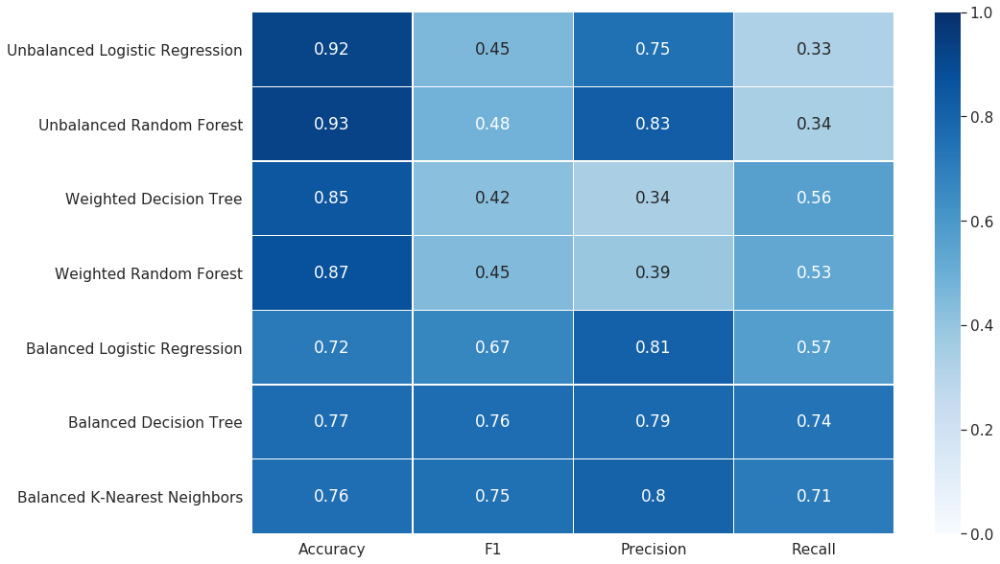

# WSDM - KKBox's Churn Prediction Challenge

>KKBOX is Asia’s leading music streaming service, holding the world’s most
>comprehensive Asia-Pop music library with over 30 million tracks.
>They offer a generous, unlimited version of their service to millions of
>people, supported by advertising and paid subscriptions. This delicate
>model is dependent on accurately predicting churn of their paid users. (...)
>
>In this challenge, you are asked to predict whether a user will churn
>after his/her subscription expires. (...)


Source: [Kaggle Competition](https://www.kaggle.com/c/kkbox-churn-prediction-challenge/overview)


## Project description

> **What Is Customer Churn?**

> Customer churn is the percentage of customers that stopped using your company's product or service during a certain time frame.

[Source](https://blog.hubspot.com/service/what-is-customer-churn)


The goal of this project is to predict whether or not a user
will leave the music streaming service after their subscription expires.


### Requirements

This project was written in Python 3.8. In order to set up and use a conda environment
with all the required packages, you can run:
```
conda env create -f conda_env.yml
conda activate churn-prediction
```

## Dataset

Data used for this project can be found at [the competition's page](https://www.kaggle.com/c/kkbox-churn-prediction-challenge/data).
(As the CSV files are quite large, they are not a part of this repository).

In order to decrease memory requirements, I decided to consider only a part of the original dataset.

### Files used

The following file names correspond to the data from Kaggle's website:

* `members_v3.csv`
* `sample_submission_v2.csv`
* `train_v2.csv`
* `transactions_v2.csv`

In order to run the scripts correctly, the data should be downloaded
and located in `data/` directory, with their names unchanges.
(Since the default download file format is compressed, they should be extracted
  to plain CSVs first.)


## Data Analysis

The project is divided into three Jupyter notebooks:

* `01_Exploration_and_preprocessing`, in which I make initial dive into the data, preprocess it,
as well as do feature selection.
* `02_Model_training`, containing seven different classifiers and their training process.
* `03_Evaluation_and_conclusion`, comparing the models trained before and choosing the best ones.


## Models

Seven different classifiers are taught:

* Unbalanced Logistic Regression Classifier,
* Unbalanced Random Forest Classifier,
* Weighted Decision Tree Classifier,
* Weighted Random Forest Classifier,
* Balanced Logistic Regression Classifier,
* Balanced Decision Tree Classifier,
* Balanced K-Nearest Neighbors Classifier.

Here's a table with their respective scores:



## Summary

Although unbalanced models have the highes accuracy, the also have the lowest recall score, which is the most important metric for unbalanced data.

Weighted decision tree models are doing a little bit better, but their precision is the lowest.

The best results were, as expected, achieved by balanced models.

Balanced Decision Tree and Balanced K-Nearest Neighbors have comparable results across all the metrics used, however, the latter took significantly longer time to learn. For this reason, I believe that a balanced decision tree should be used for further predictions.

It's worth to mention that all the models used scaled datasets, which significantly decreased their learning times.
